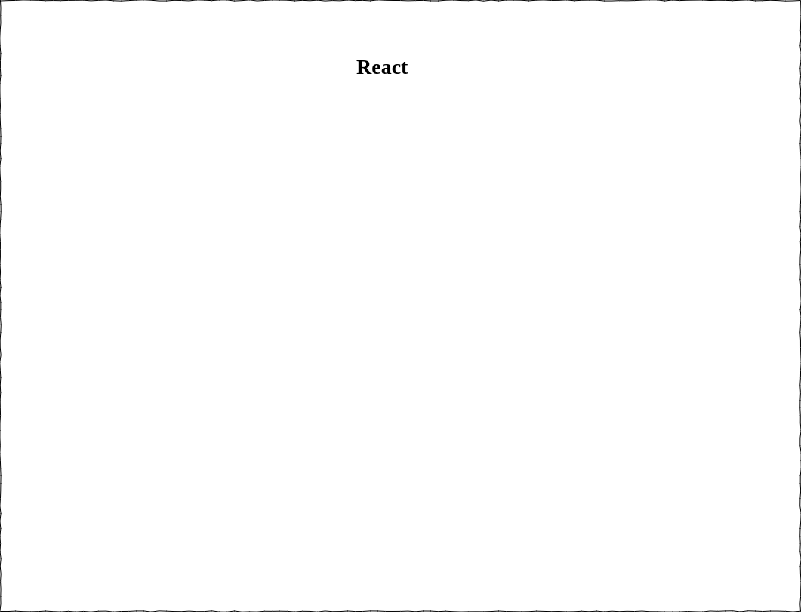

# Criando um componente básico com ReactJs

### Objetivo

O objetivo desta tarefa é criar um componente ReactJs básico com o seguinte formato.

- Renderizar uma tag H1 com a palavra React;
- A palavra precisa ter um estado inicial vazio e ter a palavra React atribuida ao estado da mesma antes da renderização do componente.

### O que será aprendido?

Como criar um componente básico usando ReactJs, fazendo uso de estado e atualizando o mesmo.
